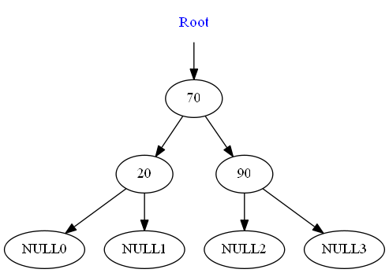
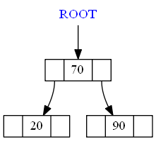
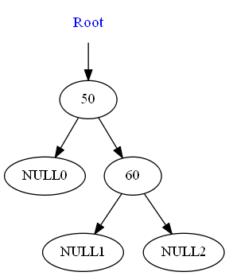
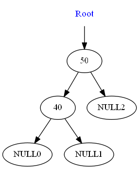
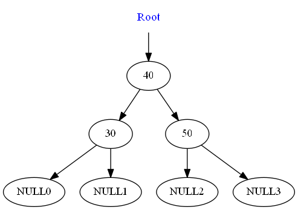
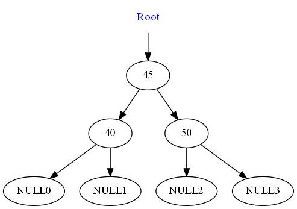
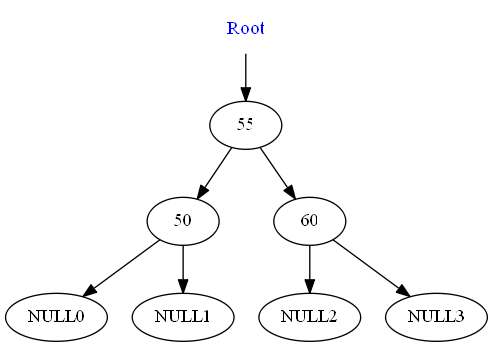
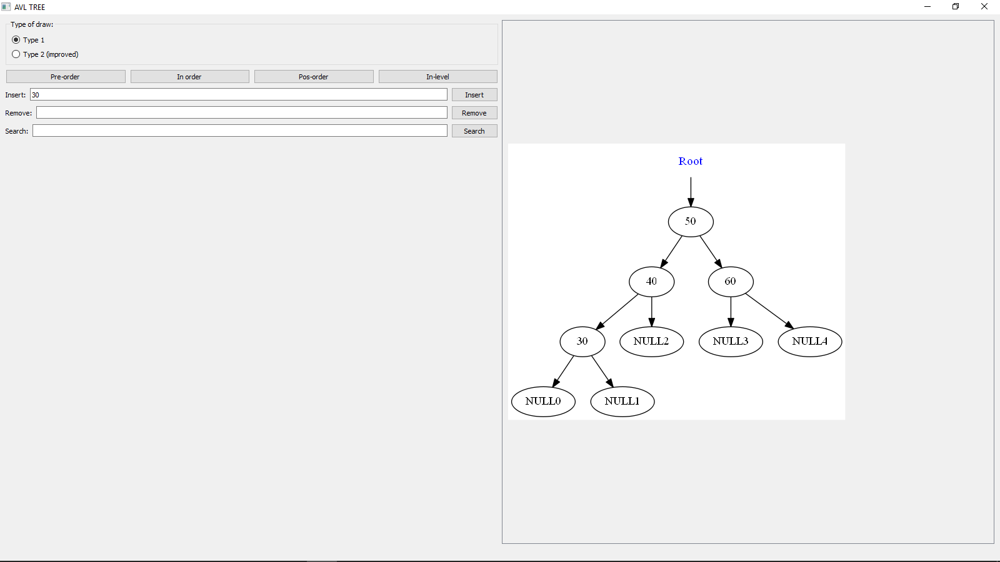
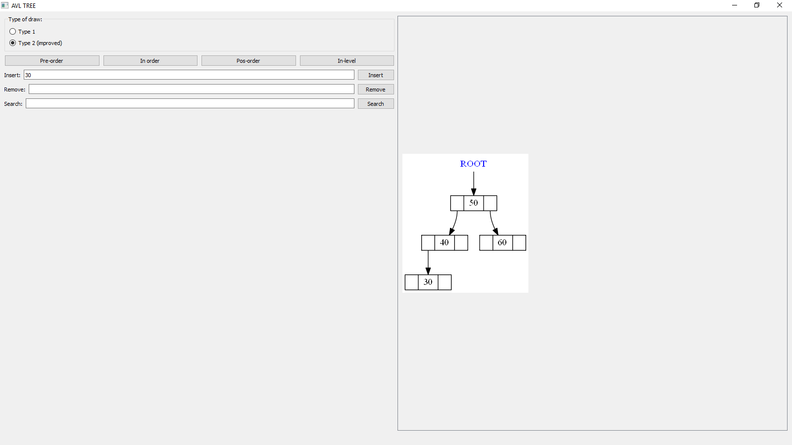
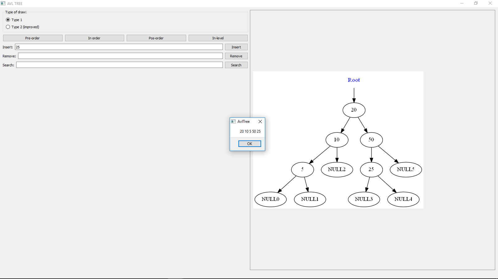

AVL Tree
====================
Build with Travis: 

This repository has a project with the implementation of a AVL Tree.

It is written in C++.

The code of the AVL Tree is independent of platform.

Is has two possible main files:

* [Codes](#markdown-header)
	* [A main that triggers unit test;](#markdown-header-emphasis)

	* [A Qt project to manage the AVL Tree (With Gui).](#markdown-header-strikethrough)
	
The library used to make the Unit Test is the Catch v2.12.3. The code is already in this repository.

The Qt project generates images of the AVL Tree, using the lib Graphviz.
Install this lib in your computer for you to be able to create such images.

The code was written containing the Doxygen documentation.

- - -

You have several options to build the project: 
====================

* [Build tools](#markdown-header)
	* [Makefile (using the file named MakefileGeneral);](#markdown-header-emphasis)
	* [CMake.](#markdown-header-emphasis)
	* [Qt Project (With QMake).](#markdown-header-emphasis)

The project has no leaks (Fully tested with Valgrind).

All the unit tests are ok.

- - -

The functionalities available are: 
====================

* [Functionalities](#markdown-header)
	* [Insert;](#markdown-header-emphasis)
	* [Search;](#markdown-header-emphasis)	
	* [Remove;](#markdown-header-emphasis)
	* [In-order traversal;](#markdown-header-emphasis)
	* [Pos-order traversal;](#markdown-header-emphasis)
	* [Pre-order traversal;](#markdown-header-emphasis)
	* [In-level traversal;](#markdown-header-emphasis)
	
- - -

Sample images: 
====================

## Type of view 1

## Type of view 2

Rotations in images: 
====================

## Left Rotation
### Inserting 50

### Inserting 60

### Inserting 70

## Right Rotation
### Inserting 50

### Inserting 40

### Inserting 30

## Left-right Rotation
### Inserting 50

### Inserting 40

### Inserting 45

## Right-left Rotation
### Inserting 50

### Inserting 60

### Inserting 55

Qt gui project: 
====================
The qt gui application gui is shown below:

## Type of view 1

## Type of view 2

Pre-order: 
====================

In-order: 
====================

Pos-order: 
====================

In-level: 
====================

